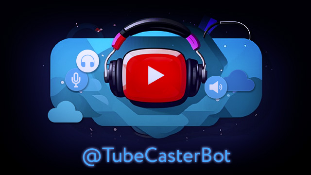

<!--
 @since 2024.11.20, 02:55
 @changed 2025.09.02, 02:57
-->

# TubeCaster Telegram Bot

[TubeCasterBot](https://t.me/tubecasterbot) is a simple telegram bot aimed to convert youtube videos into audio podcasts for later listening (even in offline mode) inside the Telegram app.

## Build info (auto-generated)

- Project info: v.0.2.1 / 2025.10.14 17:45:32 +0300

## Key User Features

- Send/share a YouTube link and receive mp3 file almost immediately (depends on a current processing queue).
- Get detailed information about the YouTube video.
- Download tracks for listening anywhere, anytime.

## Perfect For

- For listening to talk shows, music, or videos that don't contain a lot of video content.
- For busy users who prefer audio videos or who find it more convenient to listen to podcasts on the go.
- This is essential to circumvent censorship blocks (as, for example, in modern Russia, where YouTube is blocked, but Telegram is still available).

## How to Use

- **Start Chat** with [@TubeCaster](https://t.me/tubecasterbot). Request registration from menu or by `/register` command.
- **Paste YouTube Link** or share it from YouTube app.
- **Download MP3** or listen it right from the chat.

## Application Features

- Remote realtime logging via http or syslog. It's possible to receive application logs in the realtime on the developer machine during troubleshooting process.
- Different database providers for local development and production via prisma. (It's the only to way to use db on vercel hosting to switch to Postgres.)
- Actual audio length calculation (via ffprobe packets list command). Sometimes the generated files contain incorrect meta information, in which case the only way out is to get real data using ffprobe.
- Large audio files splitting on-the fly. If the file size exceeds the telegram API limit (50MB), it is split into several smaller files before being sent to the user.
- Testing with partial functional/local resources.
- A simple authorization system (using requests). At some point, we decided to restrict access to the bot only to registered users. Now all the new users are required to send a registration request.
- Detecting delays in the processing queue. In this case, repeated messages are periodically sent indicating that the request is still being processed.

## Tech Insides

- A development branch of yt-dlp used for video processing (fetching info and audio tracks).
- The bot itself is implemented using pyTelegramBotAPI v.4 and flask v.3.
- The bot's [landing page](https://tubecaster.lilliputten.com/) is a playground for my another toy: the [Gulp LQIP small image placeholder generator](https://github.com/lilliputten/gulp-embed-lqip-as-background) plugin.

## Resources

The bot itself: https://t.me/tubecasterbot

Repository: https://github.com/lilliputten/tubecaster-telegram-bot

Landing page with basic info: https://tubecaster.lilliputten.com/

Landing repository: https://github.com/lilliputten/tubecaster-landing

## Updating and deploying

Don't forget to invoke `/start` route from the deployed application to point the telegram webhook api to the actual address (see also `WEBHOOK_HOST` environment parameters).

Keep in mind that deploy on the dedicated VDS server is actually proceeded only for the `main` branch (or other specific if they included into the automatic-webhook-deploy configuration).

This bot using a disk space for audio file operations (downloading, splitting etc) so it's not possible to use vercel hosting.

## See also

- [Vercel deployment](README.vercel-deployment.md) -- Unused as it's turned out that video and audio related operation require some disk space which is absent on vercel service.
- [Youtube downloader library notes](README.ytdl.md)
- [Changelog](CHANGELOG.md)
